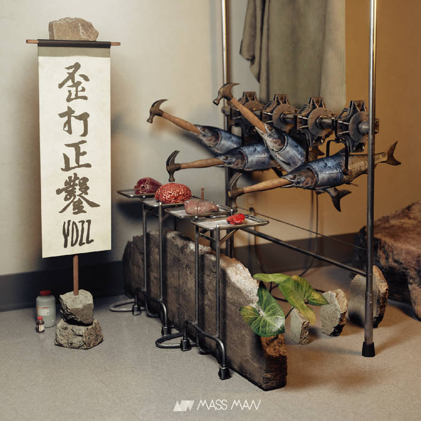
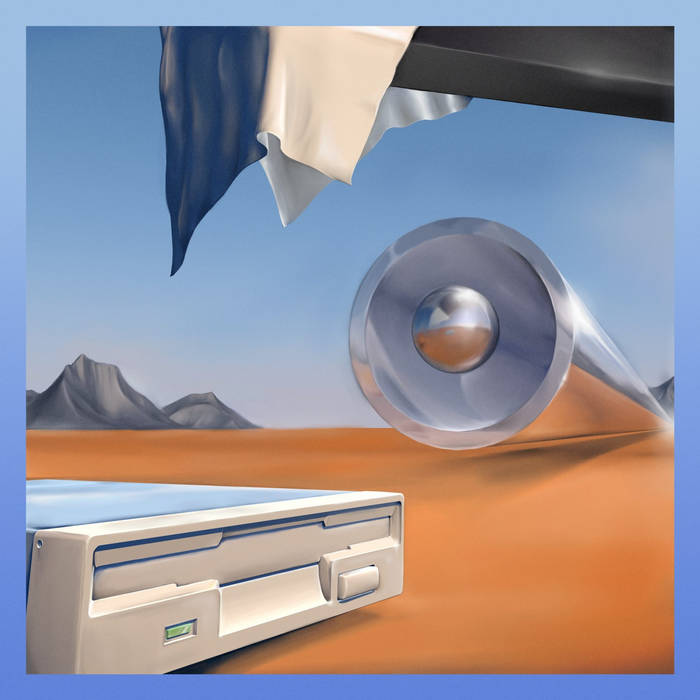
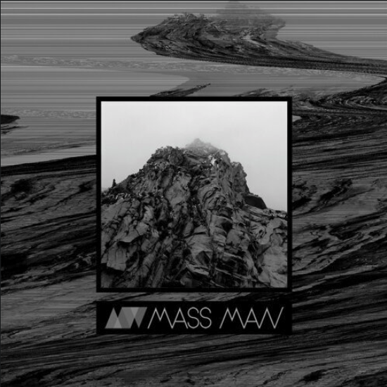

## Bio

「很高興台灣有一組後搖滾樂團勇於拒絕悲愴，刺激、幽默、挖掘生活並熱愛音樂，從生活中尋找樂子，淬煉屬於自己的景觀。這是一件很棒的事情，面對百無聊賴的現代社會，一場沒有言語的抗爭，奔馳的 MassMan，讓你忘了傷。」- Neuva, from Seed Toss

MassMan 是來自台灣的純樂器演奏樂團，於 2011 年結成於台北市，初期成員有來來 (dr.)、肉球 (bs.) 、許徐 (gt.) 與乳儒 (gt.)。2013 年末發行同名 EP ，由疊墨唱片發行。2015 年中發行首張專輯 《兔脫》，由樂團本身自行發行。2016 年許徐因生涯規劃而離團，其餘三人繼續嘗試以新編制進行創作。 2017 年樂團成員們的好友輝彥 (gt.) 加入了 MassMan 。 2021 年末發行第二張專輯 《歪打正鑿》，獲得了相當不賴的評價。

MassMan 的音樂風格自成團以來不停地改變，最初的作品受日本後搖滾 / 數學搖滾影響深厚，追求的是氛圍的營造與抒情。隨著團員們各自聆聽範圍的增長， MassMan 的音樂受到了更多前衛搖滾、後硬蕊與具象音樂的影響，而這些改變也很具體地呈現在最新的作品之中。在錄音室作品之外， MassMan 也多次站上全台各地的演出場館舞台，包含了 Legacy、 Revolver、浮現、 百樂門等。

## Albums

### 歪打正鑿 / YDZZ

Release Date: 2021/11/01

Streaming:

- [Spotify](https://open.spotify.com/album/64tZYMFW0D9fc1cnNeIKhs?si=LnuPGuWlRa25iTdWPBfTmQ)
- [Bandcamp](https://f4.bcbits.com/img/a1439109114_16.jpg)

「相較於過去戰鬥場景佔七成的 MassMan，《歪打正鑿》的劇情畫面更加豐沛，從手部機械關節的反光，到能量條的起落，從主人公踏著水漥衝向駕駛座，到怪獸保護幼獸的最後一聲叫嘯，全都在 MassMan 長得像樂器的鏡頭下閃閃發光。」 - Pillof, from Super Napkin

### 兔脫 / A Trip Into the Rabbit Hole

Release Date: 2015/08/27

Streaming:

- [Bandcamp](https://massman.bandcamp.com/album/a-trip-into-the-rabbit-hole)
- [StreetVoice](https://streetvoice.com/massmanb99/songs/album/97265119/)

Press:

- [精準的節拍與音符 ─ MassMan《A Trip Into The Rabbit Hole》](https://blow.streetvoice.com/17020/)

### 同名 EP / Self-titled EPK

Release Date: 2013/11/24

Streaming:

- [YouTube](https://www.youtube.com/playlist?list=PL84Gr3ot77o7Sd9IWFMqtSLvGzznOI8i2)

Press:

- [MassMan - 質量人吸引無邊際的奇想](https://www.xinmedia.com/article/15643)

## Pictures

TODO

## Social Media Links

- [Facebook](https://www.facebook.com/MassManb99)
- [Instagram](https://www.instagram.com/massmanb99/)
- [Bandcamp](https://massman.bandcamp.com/)
- [YouTube](https://www.youtube.com/user/MassManB99)
- [StreetVoice](https://streetvoice.com/massmanb99/)

## Contact

[Gmail](mailto:massmanb99@gmail.com)
